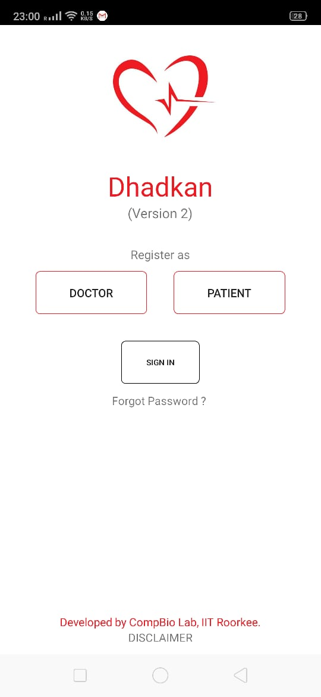

<!-- PROJECT SHIELDS -->
[![Build Status][build-shield]]()
[![Contributors][contributors-shield]]()
[![MIT License][license-shield]][license-url]
[![LinkedIn][linkedin-shield]][linkedin-url]

<br />
<p align="center">
  <a href="https://github.com/shreya2feb/dhadkan_v3_mobile">
    
  </a>

  <h3 align="center">Dhadkan Mobile App</h3>

  <p align="center">
    Connect with your doctor easily :heart:
    <br />
    <br />
    <a href="#">View Demo</a>
    ·
    <a href="https://github.com/n3m3sis00/a_reactnative_app/issues">Report Bug</a>
    ·
    <a href="https://github.com/n3m3sis00/a_reactnative_app/issues">Request Feature</a>
  </p>
</p>


<!-- TABLE OF CONTENTS -->
## Table of Contents

* [About the Project](#about-the-project)
  * [Built With](#built-with)
* [Getting Started](#getting-started)
  * [Prerequisites](#prerequisites)
  * [Installation](#installation)
* [Contributing](#contributing)
* [License](#license)
* [Contact](#contact)
* [Acknowledgements](#acknowledgements)


<!-- ABOUT THE PROJECT -->
## Dhadkan
<p align="center">
  <br>
  for more click <a href="https://github.com/n3m3sis00/a_reactnative_app/blob/final_apk/img/react_app.md">here</a>
</p>

Dhadkan is a Mobile App for remotely monitoring and providing medical assistance to the patients of heart failure. It collects patient's data (at any desired interval) on blood pressure, heart rate, and weight, and transmits it to the authorized caregiver (a doctor, nurse or paramedic) who is linked to the patient during the initial registration. It also provides a two-way communication between doctors and patients. In addition, patients have the freedom to send ECG report(s) to the doctor (if needed). Most importantly, it automatically sends a notification to both the doctor and the patient, in case(s) of any drastic changes in patient's data indicating a possibility of imminent heart failure. Thus, it not only eliminates the need for manual monitoring of each patient by the doctor but also helps them in proactively recommending precautionary action during the treatment period.

We strongly believe that this Mobile App will tremendously help in saving the precious lives of heart failure patients.

### Built With
Completely with React Native and it's supporting libraries worth mentioning libraries and frameworks:
* [React Native](https://python.com)


<!-- GETTING STARTED -->
## Getting Started
Follow the given commands and documentation to make run Dhadkan mobile app on to your local machine.

### Prerequisites
* React Native : Properly installed react native is highly required please visit official documentation to how to install react native specific to your machine.

### Installation
```sh
git clone https://github.com/n3m3sis00/a_reactnative_app.git
```
```sh
cd a_reactnative_app
```
```sh
npm install
```
Before running the final command please keep in mind that either emulator(for Android) or simulator(for IOs) is running on your machine, because sometimes it does not open with command..

```sh
react-native run-android #for running on android
```

```sh
react-native run-ios #for running on IOs
```

## gen apk
```bash
delete index.android.bundle

react-native bundle --platform android --dev false --entry-file index.js --bundle-output android/app/src/main/assets/index.android.bundle --assets-dest android/app/src/main/res/

gredlew clean
delete build folder
gradlew assembleRelease
```

```bash
delete index.android.bundle

react-native bundle --platform android --dev false --entry-file index.js --bundle-output android/app/src/main/assets/index.android.bundle --assets-dest android/app/src/main/res/

open project in android studio and generate signed bundle and apk
```

<!-- CONTRIBUTING -->
## Contributing

Contributions are what make the open source community such an amazing place to be learn, inspire, and create. Any contributions you make are **greatly appreciated**.

1. Fork the Project
2. Create your Feature Branch (`git checkout -b feature/AmazingFeature`)
3. Commit your Changes (`git commit -m 'Add some AmazingFeature`)
4. Push to the Branch (`git push origin feature/AmazingFeature`)
5. Open a Pull Request


<!-- LICENSE -->
## License

Distributed under the Apache License. See `LICENSE` for more information.


<!-- CONTACT -->
## Contact

Shreya  - ssrivastava@bt.iitr.ac.in


Project Link: [https://github.com/n3m3sis00/a_reactnative_app](https://github.com/n3m3sis00/a_reactnative_app)


<!-- ACKNOWLEDGEMENTS -->
## Acknowledgements
* [React Native](https://facebook.github.io/react-native/)


<!-- MARKDOWN LINKS & IMAGES -->
[build-shield]: https://img.shields.io/badge/build-passing-brightgreen.svg?style=flat-square
[contributors-shield]: https://img.shields.io/badge/contributors-2-orange.svg?style=flat-square
[license-shield]: https://img.shields.io/badge/license-apache-blue.svg?style=flat-square
[license-url]: https://github.com/shreya2feb/dhadkan_v3_mobile/blob/master/LICENSE
[linkedin-shield]: https://img.shields.io/badge/-LinkedIn-black.svg?style=flat-square&logo=linkedin&colorB=555
[linkedin-url]: https://www.linkedin.com/in/durgesh-kumar-807233157/
