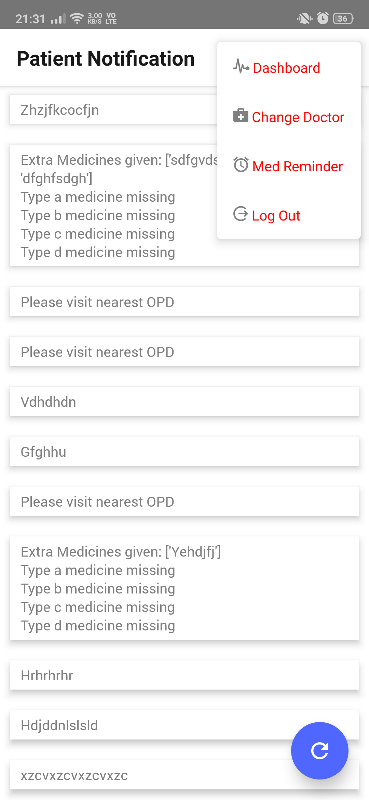

  

  <h3 align="center">Dhadkan Mobile App</h3>

  

    Connect with your doctor easily :heart:
     
     
    <a href="https://play.google.com/store/apps/details?id=com.dhadkan&hl=en">View</a>
    ·
    <a href="https://github.com/orionpax00/react_app/issues">Report Bug</a>
    ·
    <a href="https://github.com/orionpax00/react_app/issues">Request Feature</a>
  

# Dhadkan

Dhadkan is a Mobile App for remotely monitoring and providing medical assistance to the patients of heart failure. It collects patient's data (at any desired interval) on blood pressure, heart rate, and weight, and transmits it to the authorized caregiver (a doctor, nurse or paramedic).

## Built With
Completely with React Native and it's supporting libraries worth mentioning libraries and frameworks:
* [React Native](https://facebook.github.io/react-native/)

<table border="0" bordercolor="red" align="center">
    <tr>
        <th colspan="4">Feature and UI</th> 
    </tr>
    <tr>
        <th></th>
        <th></th>
        <th></th>
        <th></th>
    </tr>
    <tr>
        <th></th>
        <th></th>
        <th></th>
        <th></th>
    </tr>
    <tr>
        <th></th>
        <th></th>
        <th></th>
        <th></th>
    </tr>
    <tr>
        <th></th>
        <th></th>
        <th></th>
        <th></th>
    </tr>
    <tr>
        <th></th>
        <th></th>
        <th></th>
        <th></th>
    </tr>
    <tr>
        <th></th>
        <th></th>
        <th></th>
    </tr>
</table>
